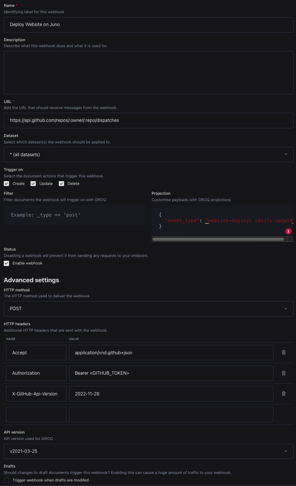

# ic-sanity

This template enables you to deploy an Astro + Sanity website on the Internet Computer. The deployment is done through [Juno](https://juno.build/).

> 🌟 **New to Juno?** Check it out at [juno.build](https://juno.build/)

> 🚀 **New to Astro?** Check it out at [astro.build](https://astro.build/)

> 🎯 **New to Sanity?** Check it out at [sanity.io](https://sanity.io/)

## Usage

### Requirements

Make sure you have the following installed:

- [Node.js](https://nodejs.org/en/download/)
- [pnpm](https://pnpm.io/)
- [Juno CLI](https://juno.build/docs/miscellaneous/cli)

### Local development

1. Clone this repository (or use it as a template for your own project) and install dependencies:

   ```bash
   git clone https://github.com/ICP-HUB-Italy-Ticino/ic-sanity.git
   cd ic-sanity
   pnpm install
   ```

2. Create a satellite on Juno ([guide](https://juno.build/docs/create-a-satellite)). Copy the satellite ID once done.
3. Login to the Juno console and link the new satellite once asked:

   ```bash
   juno login
   ```

4. Update the `<your-satellite-id>` in the [`juno.config.ts`](./juno.config.ts) file with the new satellite ID.
5. Create a new project with a dataset on Sanity ([guide](https://www.sanity.io/docs/getting-started-with-sanity)). Copy the project ID and the dataset name once done.
6. Set the environment variables in the `.env` file, following the [.env.example](./.env.example) template.
7. Deploy your project on Juno:
   ```bash
   pnpm run deploy
   ```

You can now access your website at `https://<your-satellite-id>.icp0.io` and the [Sanity Studio](https://www.sanity.io/studio) at `https://<your-satellite-id>.icp0.io/studio`.

Every time you make a change, you have to deploy your project again with the Juno CLI:

```bash
pnpm run deploy
```

Have a look at the [Set up the GitHub Action](#set-up-the-github-action) and/or [Set up Sanity deployments](#set-up-sanity-deployments) to configure automatic deployments.

You can run the local preview with:

```bash
pnpm dev
```

### Set up the GitHub Action

In order to deploy your website to production every time you push to the `main` branch, you need to set up a GitHub Action. There's already a GitHub Action set up for this repository, check it out at [deploy.yaml](./.github/workflows/deploy.yaml).

You need to configure the same environment variables of your `.env` file as GitHub Action variables ([guide](https://docs.github.com/en/actions/writing-workflows/choosing-what-your-workflow-does/store-information-in-variables)):

- `JUNO_TOKEN` ([guide](https://juno.build/docs/guides/github-actions))
- `SANITY_STUDIO_PROJECT_ID`
- `SANITY_STUDIO_DATASET`

> We recommend you to set up GitHub variables instead of secrets for the `SANITY_STUDIO_*` variables, so that you can always lookup the values of these variables at any time. If you choose to set up secrets instead, make sure you update the [deploy.yaml](./.github/workflows/deploy.yaml) action to read the values from the secrets.

The [deploy.yaml](./.github/workflows/deploy.yaml) action is configured to run:

- when commits are pushed to the `main` branch
- when dispatched [manually](https://docs.github.com/en/actions/managing-workflow-runs-and-deployments/managing-workflow-runs/manually-running-a-workflow)
- when triggered from a webhook, see [Set up Sanity deployments](#set-up-sanity-deployments) and the [GitHub docs](https://docs.github.com/en/actions/writing-workflows/choosing-when-your-workflow-runs/events-that-trigger-workflows#repository_dispatch)

### Set up Sanity deployments

In order to update the content of the website every time you save a document on Sanity, you need to set up Sanity to trigger a deployment on GitHub.

Before configuring the Sanity webhook, you need to obtain a GitHub token. See [Authenticating with a personal access token](https://docs.github.com/en/rest/authentication/authenticating-to-the-rest-api?apiVersion=2022-11-28#authenticating-with-a-personal-access-token) and make sure you give **Read** and **Write** permissions for [Contents](https://docs.github.com/en/rest/authentication/permissions-required-for-fine-grained-personal-access-tokens?apiVersion=2022-11-28#repository-permissions-for-contents).

1. Go to the API settings of your Sanity project and click on _+ Create webhook_
2. Configure the webhook with the following settings:

   - **Name**: a custom name like "Deploy Website on Juno" or so
   - **URL**: `https://api.github.com/repos/<your-github-username>/<your-repo>/dispatches`
   - **Dataset**: choose on which datasets you want to trigger the deployment
   - **Trigger on**: Select all the available options: _Create_, _Update_, _Delete_
   - **URL**: `https://<your-satellite-id>.icp0.io/.netlify/functions/sanity`
   - **Projection**:

     ```json
     {
       "event_type": "website-deploy: sanity update"
     }
     ```

     The content of the `event_type` field is arbitrary and can be whatever you want. It will appear as the workflow run name in the GitHub Actions section of the repository.

   - **HTTP method**: POST
   - **HTTP headers**:
     | Name | Value |
     | --- | --- |
     | `Content-Type` | `application/vnd.github+json` |
     | `Authorization` | `Bearer <your-github-token>` |
     | `X-GitHub-Api-Version` | `2022-11-28` (change this if needed) |

   Leave all the other fields empty/with default values.

   The configuration should look like this:
   

3. Save the webhook

After saving the webhook, you should see the workflow run in the GitHub Actions section of the repository every time you publish some content on Sanity.
